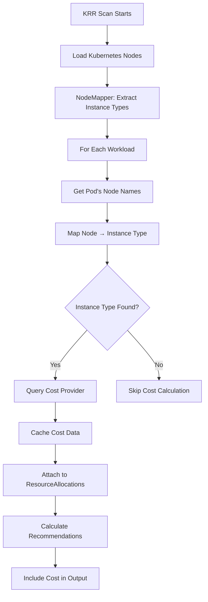

# Cost Integration Flow - How Instance Types are Determined

This document explains the complete flow of how KRR determines instance types and queries cost data.

## Current Implementation Status

### ✅ What's Implemented
1. Cost provider infrastructure (`cost_providers/`)
2. Vantage API client
3. CLI options for cost configuration
4. Cost data fields in models

### ❌ What's Missing
The actual integration between KRR's workload scanning and the cost provider. Here's what needs to happen:

## Complete Flow (How it Should Work)



## Detailed Steps

### 1. Loading Nodes and Instance Types

When KRR starts scanning, it needs to:

```python
# In runner.py or kubernetes loader
async def load_nodes_info(self):
    """Load all nodes and extract instance information"""
    nodes = await self._k8s_loader.list_nodes()
    
    for node in nodes:
        node_info = self._node_mapper.get_node_instance_info(node)
        # Cache: node_name -> {instance_type, region, zone}
```

### 2. Mapping Workloads to Nodes

For each workload being scanned:

```python
# In _calculate_object_recommendations
async def _calculate_object_recommendations(self, object: K8sObjectData):
    # ... existing code ...
    
    # NEW: Determine which nodes the workload runs on
    pod_nodes = await self._get_workload_nodes(object)
    
    # NEW: Get instance type from those nodes
    node_info = self._node_mapper.get_workload_node_info(pod_nodes)
    
    if node_info and node_info.get('instance_type'):
        # NEW: Query cost provider
        cost_data = await self._get_cost_data(
            instance_type=node_info['instance_type'],
            region=node_info['region']
        )
        
        # Attach cost data to allocations
        if cost_data:
            recommendation.cost_data = cost_data
```

### 3. Getting Workload Nodes

The missing piece - determining which nodes a workload runs on:

```python
async def _get_workload_nodes(self, object: K8sObjectData) -> List[str]:
    """Get list of nodes where this workload's pods are running"""
    
    # Get pods for this workload
    pods = await self._k8s_loader.list_pods(object)
    
    # Extract unique node names
    node_names = set()
    for pod in pods:
        if pod.spec and pod.spec.node_name:
            node_names.add(pod.spec.node_name)
    
    return list(node_names)
```

### 4. Querying Cost Data

```python
async def _get_cost_data(self, instance_type: str, region: str) -> Optional[CostData]:
    """Get cost data for a workload"""
    
    if not self._cost_provider:
        return None
    
    # For now, assume same instance type for recommendation
    # Future: calculate optimal instance type based on resource usage
    
    try:
        cost_data = await self._cost_provider.get_workload_cost(
            current_instance_type=instance_type,
            recommended_instance_type=instance_type,  # TODO: optimize
            region=region
        )
        return cost_data
    except Exception as e:
        logger.warning(f"Failed to get cost data: {e}")
        return None
```

## Current Workaround

Since this integration is not complete, to use cost features you would need to:

1. **Manually determine instance types**:
   ```bash
   kubectl get nodes -o custom-columns=NAME:.metadata.name,TYPE:.metadata.labels.node\\.kubernetes\\.io/instance-type
   ```

2. **Add labels if missing**:
   ```bash
   kubectl label nodes <node-name> node.kubernetes.io/instance-type=<type>
   ```

3. **Future Enhancement**: Complete the integration as shown above

## Example: What Should Happen

When you run:
```bash
krr simple --cost-provider vantage --vantage-api-key YOUR_KEY
```

1. KRR loads all nodes and caches their instance types
2. For each workload (e.g., nginx deployment):
   - Finds pods: nginx-7f89b6c4-abc, nginx-7f89b6c4-def
   - Gets their nodes: node-1, node-2
   - Looks up node-1's instance type: m5.large
   - Queries Vantage: "What's the cost of m5.large in us-east-1?"
   - Attaches cost data to the recommendation
3. Output includes accurate cost savings

## Why This Matters

Without this integration:
- Cost provider is configured but never actually used
- No instance type is passed to Vantage API
- Cost calculations fall back to rough estimates

## Implementation Priority

To complete cost integration:

1. **High Priority**: Add `NodeMapper` to kubernetes loader
2. **High Priority**: Integrate into `_calculate_object_recommendations`
3. **Medium Priority**: Optimize instance type selection for recommendations
4. **Low Priority**: Handle heterogeneous node pools

## Testing the Flow

To verify instance type detection works:

```bash
# Enable verbose logging
krr simple --cost-provider vantage -v

# Should see logs like:
# INFO: Node node-1 is instance type m5.large in us-east-1/us-east-1a
# INFO: Querying cost for m5.large in us-east-1
# INFO: Cost data cached for m5.large
``` 