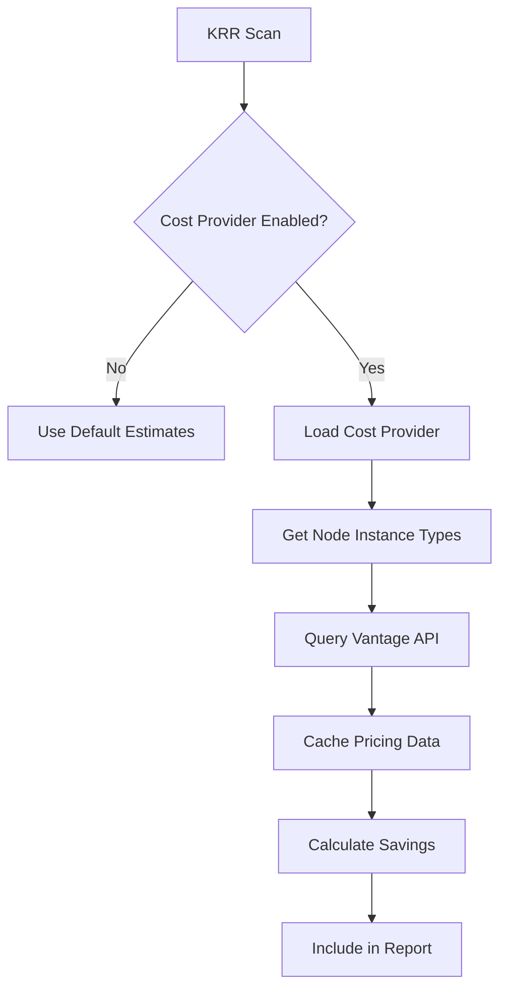

# Cost Integration Design

**Author:** Assistant  
**Date:** 2025-01-28  
**Status:** Work in Progress  
**Sprint:** 5-6 (Q2 2025)

## Overview

This proposal adds optional cost integration to KRR, enabling dollar-based savings calculations using cloud provider pricing. The initial implementation will support Vantage API for AWS costs, with a plugin architecture for future providers.

## Goals

1. **Optional Integration**: Cost features are completely optional - KRR works without any cost provider
2. **Accurate Pricing**: Use real cloud pricing data instead of rough estimates
3. **Multi-Currency**: Support different currencies for global teams
4. **Extensible**: Easy to add new cost providers (Azure, GCP, on-prem)
5. **Performance**: Minimal impact on scan performance

## Architecture

### Cost Provider Interface

```python
class CostProvider(ABC):
    """Abstract base class for cost providers"""
    
    @abstractmethod
    async def get_instance_cost(self, instance_type: str, region: str) -> InstanceCost:
        """Get hourly cost for an instance type"""
        pass
    
    @abstractmethod
    async def validate_credentials(self) -> bool:
        """Validate provider credentials"""
        pass
```

### Vantage Integration

```python
class VantageCostProvider(CostProvider):
    """Vantage API integration for AWS costs"""
    
    def __init__(self, api_key: str, currency: str = "USD"):
        self.api_key = api_key
        self.currency = currency
        self.base_url = "https://api.vantage.sh/v1"
```

### Configuration

New CLI options:
```bash
# Enable cost calculation with Vantage
krr simple --cost-provider vantage --vantage-api-key YOUR_KEY

# Specify currency
krr simple --cost-provider vantage --cost-currency EUR

# Use config file
cat > .krr.yaml <<EOF
cost_provider: vantage
vantage_api_key: ${VANTAGE_API_KEY}
cost_currency: USD
cost_cache_hours: 24
EOF
```

## Implementation Plan

### Phase 1: Core Infrastructure
1. Create cost provider interface
2. Add cost provider registry
3. Implement provider factory
4. Add cost fields to data models

### Phase 2: Vantage Integration
1. Implement Vantage API client
2. Add instance type mapping
3. Cache pricing data
4. Handle API rate limits

### Phase 3: Enhanced Calculations
1. Map K8s nodes to cloud instances
2. Calculate actual vs recommended costs
3. Add cost to all formatters
4. Currency conversion support

### Phase 4: Reporting
1. Cost-aware recommendations strategy
2. Enhanced cost reports
3. Department/team cost allocation
4. Cost trend analysis

## Data Flow



## API Integration

### Vantage API Endpoints

1. **Get AWS Costs**: `GET /costs/aws`
   - Filter by instance type
   - Filter by region
   - Get on-demand and spot prices

2. **Instance Metadata**: `GET /resources/aws/ec2`
   - Map instance types to specs
   - Get regional availability

### Caching Strategy

- Cache pricing data for 24 hours (configurable)
- Store in-memory with optional Redis backend
- Graceful fallback on cache miss
- Background refresh for stale data

## Error Handling

1. **No API Key**: Continue with default estimates
2. **API Errors**: Log warning, use cached/default values
3. **Rate Limits**: Exponential backoff, use cache
4. **Invalid Instance Types**: Log and skip cost calculation

## Security Considerations

1. API keys via environment variables
2. No keys in output/logs
3. Secure credential storage options
4. Optional credential helpers

## Testing Strategy

1. Mock Vantage API responses
2. Test with/without cost provider
3. Currency conversion tests
4. Cache behavior tests
5. Error scenario coverage

## Future Extensions

1. **Azure Cost Management API**
2. **GCP Cloud Billing API**
3. **On-premise cost models**
4. **Spot instance recommendations**
5. **Reserved instance awareness**
6. **Savings plan optimization**

## Success Metrics

- Cost calculations within 5% of actual bills
- <100ms latency added to scans
- Support for top 3 cloud providers
- 90% of users find cost data valuable

## Example Output

```yaml
# With cost integration enabled
apiVersion: krr.robusta.dev/v1alpha1
kind: ResourceRecommendation
spec:
  impact:
    estimatedSavings:
      cpu: "400m"
      memory: "384Mi"
      monthlyCost: "$47.82"  # Accurate from Vantage
      costBreakdown:
        compute: "$41.20"
        memory: "$6.62"
        currency: "USD"
        lastUpdated: "2025-01-28T10:00:00Z"
```

## Rollout Plan

1. **Alpha**: Internal testing with Vantage
2. **Beta**: Selected users with AWS
3. **GA**: Full release with documentation
4. **Future**: Additional providers 